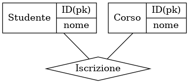

<table>
  <tr>
    <td  valign="top">
      <pre><code>
from sqlalchemy import Column, Integer, String, ForeignKey, create_engine
from sqlalchemy.orm import relationship, declarative_base
from eralchemy2 import render_er

Base = declarative_base()

class Studente(Base):
    __tablename__ = "studenti"
    id = Column(Integer, primary_key=True)
    nome = Column(String)
    corsi = relationship("Iscrizione")

class Corso(Base):
    __tablename__ = "corsi"
    id = Column(Integer, primary_key=True)
    nome = Column(String)
    studenti = relationship("Iscrizione")

class Iscrizione(Base):
    __tablename__ = "iscrizioni"
    id = Column(Integer, primary_key=True)
    studente_id = Column(Integer, ForeignKey("studenti.id"))
    corso_id = Column(Integer, ForeignKey("corsi.id"))
    studente = relationship("Studente")
    corso = relationship("Corso")

database = create_engine("sqlite:///universita.db")
Base.metadata.create_all(database)
render_er("sqlite:///universita.db", "schema.png")
      </code></pre>
    </td>
    <td valign="top">
      
    </td>

    
  </tr>
  <tr></tr>
  <tr></tr>
  <tr>
    <td><td><code>import graphviz

grafico = graphviz.Graph(comment="Schema ER")

grafico.node("S", "Studente | {<id> ID(pk) | nome}", shape="record", fontcolor="black")
grafico.node("C", "Corso | {<id> ID(pk) | nome}", shape="record", fontcolor="black")
grafico.node("R", "Iscrizione", shape="diamond")

grafico.edge("S", "R")
grafico.edge("C", "R")

grafico.render("schema", format="png", view=True)</code></pre></td>
    <td></td>
    
  </tr>
</table>
